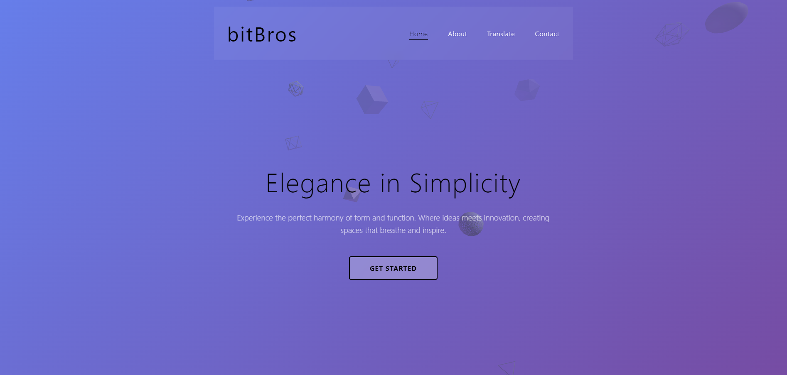
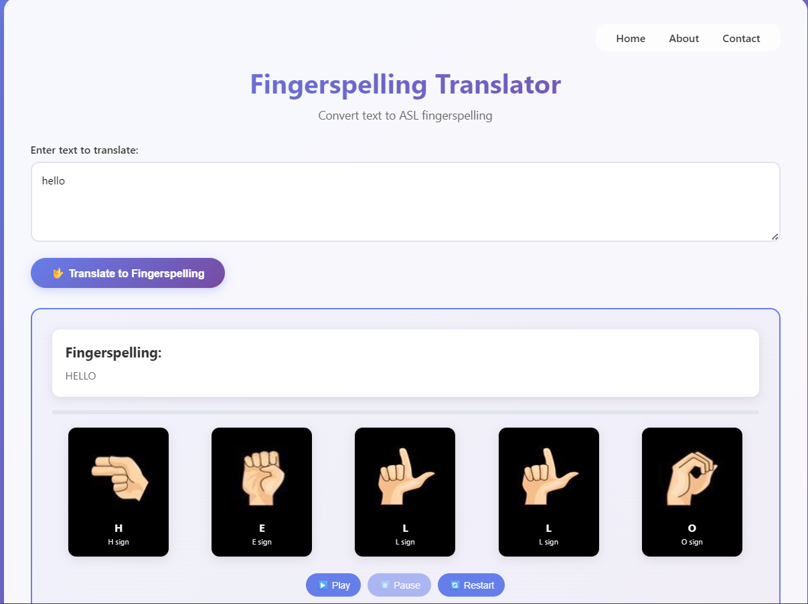
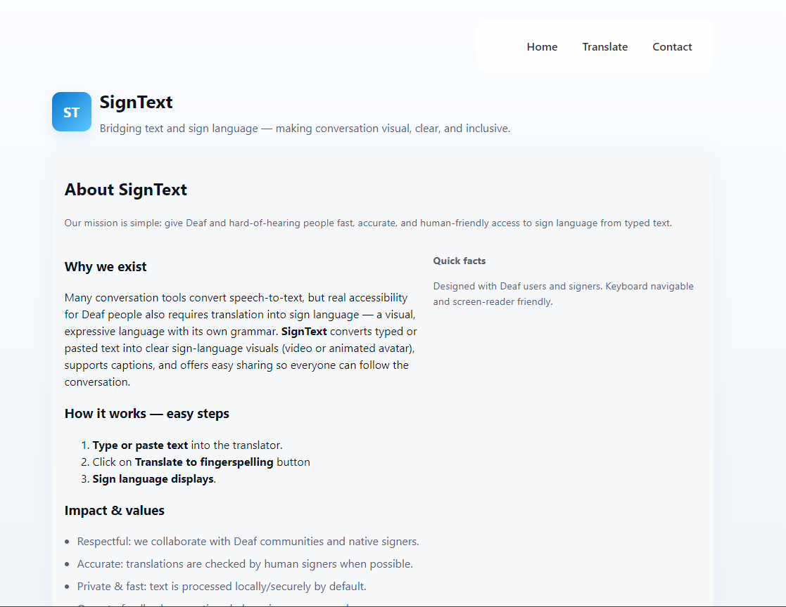
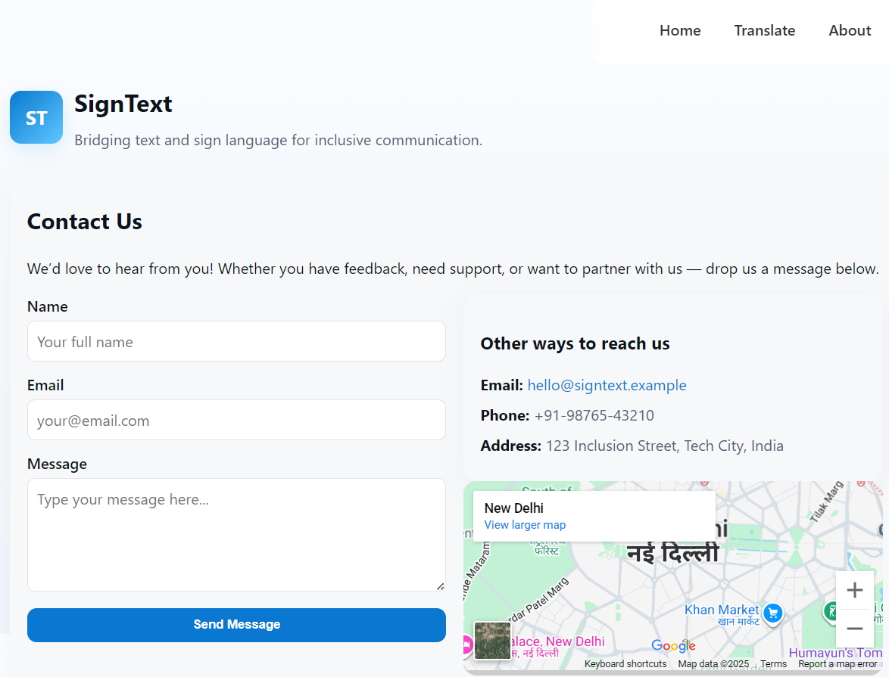

# signText 🎯

## Basic Details
It is a basic website to convert a text statement to a sign language which is accessible to the deaf people
### Team Name: bitBros

### Team Members
- Team Lead: Mohammed Sinan K - EMEA College of Arts and Science
- Member 2: Mohammed Shamil P - EMEA College of Arts and Science

### Project Description
It breaks down a sentance into a single unit of alphabet through which is displays the corresponding sign language of the particular alphabet

### The Problem (that doesn't exist)
The Illiteracy of the sign language

### The Solution (that nobody asked for)
The signtext address this prarticular challenges.

## Technical Details
### Technologies/Components Used
For Software:
- Languages used: HTML, CSS, Javascripit

### Implementation

# Run
open index.html

### Project Documentation
For Software: This project helps to translate the sentance into its corresponding sign language of each letter.

# Screenshots (Add at least 3)

This is the home page

This is the main page which convert text into sign language

This is the About page

This is the contact page

### Project Demo
# Video

This video shows the working of this project.

## Team Contributions
- Mohammed Shamil P: index.html, about.html, contact.html
- Mohammed Sinan K: translate.html

---
Made with ❤️ at TinkerHub Useless Projects 

